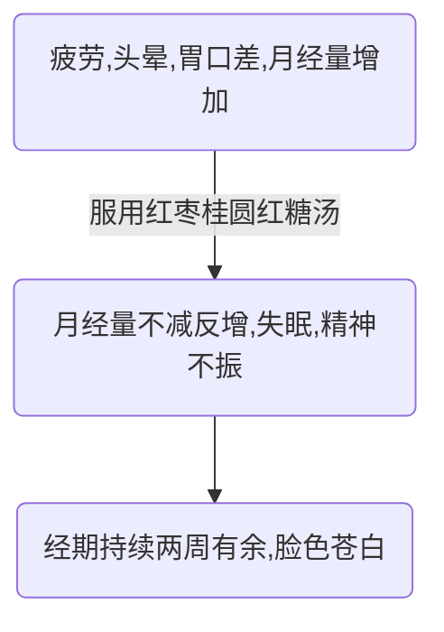

案例一  我还是一个完整的女人吗？
===========

第一幕
-----
### 疾病发展过程

### 病人基本信息
- 49岁
- 全职太太
- 两个孩子

### 问题
#### P1
- 更年期定义，表现，注意点，对策
- 月经不调定义，表现，原因，对策
    (月经量的影响因素)（考虑激素水平检查）
- 月经量增多的有关疾病
- 红枣桂圆红糖汤的作用，机理
- 生产对身体的影响

- 社区医疗政策
- 全职太太心理健康

#### P2
- 关于症状
    + 检查种类
    + 每月一个多礼拜失眠？
    + 经期出血量增多(伴随大血块)
        持续时间长原因（考虑凝血功能）
    + 症状与季节&生活状况关系
- 贫血分类（程度）

第二幕
------
### 问题
#### P1
- 关于号贩子
- 关于分级诊疗制度

#### P2
+ 关于检查适用条件（疾病）与结果解释
    - 双合诊检查
    - B超（妇产科）
    - 血常规
+ 关于多发性子宫肌瘤（病因、表现（并发症、
    月经量增多）、程度、治疗）
+ 妊娠时间与对应表现

