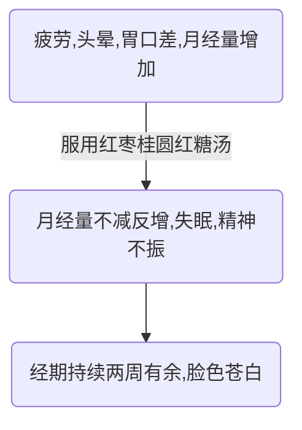

案例一  我还是一个完整的女人吗?
===========

第一幕
-----
### 疾病发展过程

### 病人基本信息
1. 49岁
1. 全职太太
1. 两个孩子

### 问题
#### P1
1. 更年期定义, 表现, 注意点, 对策
    - [定义](https://baike.baidu.com/item/围绝经期综合征/939818?fromtitle=更年期&fromid=85933): 指妇女绝经前后出现性激素波动或减少所致的一系列以自主神经系统功能紊乱为主, 伴有神经心理症状的一组症候群.
    - [表现](https://baike.baidu.com/item/围绝经期综合征/939818?fromtitle=更年期&fromid=85933#2):
        + 月经不调 (经期不规则, 经期延长, 经量变化) .
        + 情绪焦虑, 抑郁[^1]
1. 月经不调定义, 表现, 原因, 对策
    (月经量的影响因素) (考虑激素水平检查)
1. 月经量增多的有关疾病
1. 红枣桂圆红糖汤的作用, 机理
    - 红枣[^2]
        + 减缓癌细胞分裂速度, 抑制白血病细胞增殖
        + 抗氧化
        + 降低血清谷丙转氨酶水平
        + 促进淋巴细胞、脾细胞增殖, 抑制精子畸变
        + 提高白细胞内cAMP数量[^3]?
    - 桂圆[^4]
        + 抗氧化
    - 红糖[^5]
        + 免疫活性
        + 抗氧化
        + 抑制致龋齿变异链球菌, 防龋齿
        + 降低血液胆固醇, 葡萄糖水平, 预防糖尿病和高血压
        + 抑制白血病细胞增殖, 抑制乳腺癌细胞增殖
        + 降低肝脏甘油三酯水平, 预防动脉粥样硬化
1. 生产对身体的影响
1. 社区医疗政策
1. 全职太太心理健康

#### P2
1. 关于症状
    + 检查种类
    + 每月一个多礼拜失眠?
    + 经期出血量增多(伴随大血块)
        持续时间长原因 (考虑凝血功能)
    + 症状与季节&生活状况关系
1. [贫血分类 (程度)](https://baike.baidu.com/item/贫血/1080#1)
    - 按血红蛋白浓度分类:
        + 正常: 成年男性120-160g/L, 成年女性110-150g/L[^6],
            [儿童](https://baike.baidu.com/item/血常规#2_3):
            120～140g/L(12-14g/dL)
        + 轻度贫血
        + 中度贫血
        + 重度贫血
        + 极重度贫血

第二幕
------
### 问题
#### P1
1. 关于号贩子
1. 关于分级诊疗制度

#### P2
1. 关于检查适用条件 (疾病) 与结果解释
    - [双合诊检查](http://baike.sogou.com/v7770903.htm#para1)
    - [B超 (妇产科)](http://baike.sogou.com/v46586778.htm#para1)
    - [血常规](https://baike.baidu.com/item/血常规#1)

        > [临床意义]
        >
        > 中性杆状核粒细胞增高见于急性化脓性感染、
        >   大出血、严重组织损伤、慢性粒细胞膜性白血病及安眠药中毒等.
        >
        > 中性分叶核粒细胞减少多见于某些传染病、再生障碍性贫血、粒细胞缺乏症等.
        >
        > 嗜酸性粒细胞减少见于伤寒、副伤寒早期、长期使用肾上腺皮质激素后.
        >
        > 淋巴细胞增高见于传染性淋巴细胞增多症、结核病、疟疾、
        >   慢性淋巴细胞白血病、百日咳、某些病毒感染等.
        >
        > 淋巴细胞减少见于淋巴细胞破坏过多, 如长期化疗、X射线照射后及免疫缺陷病等.
        >
        > 单核细胞增高见于单核细胞白血病、结核病活动期、疟疾等.

1. 关于[多发性子宫肌瘤](https://baike.baidu.com/item/多发性子宫肌瘤#3)
    (病因、表现 (并发症、月经量增多) 、程度、治疗)
1. [妊娠时间与对应表现](https://baike.baidu.com/item/妊娠周数)

    > 宫底12周末耻骨上2～3横指.
    >
    > 16周末脐耻之间.
    >
    > 20周末脐下1横指.
    >
    > 24周末脐上1横指.
    >
    > 28周末就是晚期妊娠了, 宫底在脐上3横指.
    >
    > 32周末在脐与剑突间.
    >
    > 36周末在剑突下2横指.
    >
    > 40周末在脐与剑突间.

另, 阴超与双合诊检查对比, 阴超准确率 (88.06%) 明显高于双合诊检查符合率 (55.22%) (P小于0.05)[^7]

第三幕
------
### 问题
- 手术同意书
    + 手术同意书是指手术前, 经治医师向患者告知拟施手术的相关情况, 并由患者签署同意手术的医学文书.
    + 内容
        * 术前诊断
        * 手术名称
        * 术中或术后可能出现的并发症
        * 手术风险
        * 患者签名
        * 医师签名
- 医患沟通方式
- 麻醉种类和方式
    + 全身麻醉
        * 吸入麻醉
        * 静脉麻醉
        * 基础麻醉 (直肠注入, 肌肉注射)
    + 局部麻醉
        * 椎管内麻醉
        * 神经及神经丛阻滞
        * 脑神经阻滞
    + 复合麻醉

[^1]: Li RX et.al. Perimenopausal syndrome and mood disorders in perimenopause: prevalence, severity, relationships, and risk factors. doi:10.1097.

[^2]: 王军,张宝善,陈锦屏等.红枣营养成分及其功能的研究[J].食品研究与开发,2003,24(2):68-72.DOI:10.3969/j.issn.1005-6521.2003.02.031.

[^3]: 雷昌贵,陈锦屏,卢大新等.红枣的营养成分及其保健功能[J].现代生物医学进展,2006,6(3):56-57,62.DOI:10.3969/j.issn.1673-6273.2006.03.020.

[^4]: 李雪华,龙盛京,谢云峰等.龙眼多糖、荔枝多糖的分离提取及其抗氧化作用的探讨[J].广西医科大学学报,2004,21(3):342-344.DOI:10.3969/j.issn.1005-930X.2004.03.011.

[^5]: 徐灵均,袁义明,胡晓苹等.红糖在我国的现状及其与精制砂糖的对比分析[J].食品研究与开发,2017,38(10):209-214.DOI:10.3969/j.issn.1005-6521.2017.10.047.

[^6]: 朱大年,王庭槐等.生理学第8版,人民卫生出版社,pp.60.ISBN:978-7-117-17129-8/R.17130.

[^7]: 李承慧,周之洁,黄萍等.阴道B超在围绝经期妇女中的应用[J].上海第二医科大学学报,2000,20(Z1):53-55.DOI:10.3969/j.issn.1674-8115.2000.z1.020.
