---
title: 2017~2018学年第一学期PBL总结
author: 16010306 谢祯晖
geometry: margin=1cm
...

案例内容
-------

```mermaid
graph TD
    subgraph 汽车喷漆店的恶魔
        begin("(喷漆气味刺鼻)头晕")
        then("流鼻血(鼻衄)")
        next("低烧、咽喉发炎")
        after("咽喉发炎好转, 体温恢复正常, 但鼻衄愈发严重, 伴牙龈出血")
        blood("全血象减少")
        bone("G/E偏高, 骨髓红系↓, 淋巴细胞↓")
        dyn{"诊断"}
        diagnosis2(急性早幼粒细胞白血病)

        begin -.- 工伤,职业病
        begin --> then
                  then --> next
                           next -- 服用头孢拉定 --> after

        after -- 血常规 --- blood  ; blood --> dyn
        after -- 骨髓检查 --- bone ; bone --> dyn
        dyn --> diagnosis2
                diagnosis2 -.- 苯与苯中毒
                diagnosis2 -.- 化疗与放疗
    end
    subgraph 我还是一个完整的女人吗
        m2(疲劳,头晕,胃口差,月经量增加)
        middle(月经量不减反增,失眠,精神不振)
        m5(经期持续两周有余,脸色苍白)
        diagnosis1("诊断：多发性子宫肌瘤")
        ope(子宫切除术)

        m2 -- 服用红枣桂圆红糖汤 --> middle
                                     middle --> m5
                                                m5 --> diagnosis1
                                                m5 -.- 贫血
        diagnosis1 -.- 妇科常用检查
        diagnosis1 -.- ope
                       ope -.- 麻醉
    end
```

案例评价
-------
+ 优点
    - 案例脉络清晰
    - 与上学期相比涉及更多专业知识，减少了人文领域问题的数量。好玩。
+ 缺点
    - 突然难度增加过大，部分同学不适应。且对与所学知识偏离较远的问题无从讨论。
