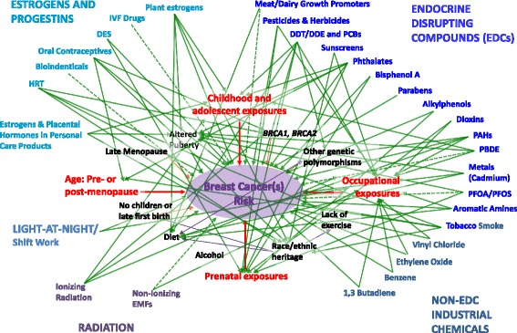
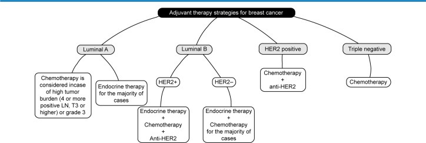

叹息的乳房
======

------

Timeline
------

------

- 当天
    + 症状：右侧乳房出现直径约2.0 cm肿块，质韧，微触痛，分界不清，活动度不好
    + 上下文
        * 工作忙碌，饮食起居无规律
        * 无常规体检
        * 年龄：35岁
        * 月经初潮：12岁
        * 分娩27岁，未哺乳，月经来潮前偶有乳腺胀痛
    + 对策
        * 口服“乳癖消”
        * 嘱咐避开月经期复查

------

- 一个月后
    + 症状
        * 右侧乳头溢出黄褐色液体
        * 右乳晕上方2cm偏外侧2.5cm x 2.0cm肿块，质地较硬，边界不清，表面不光滑
          肿块与皮肤和胸肌筋膜无明显粘连，托起乳腺，肿块前方皮肤有轻度凹陷，
          肿块近乳晕处向乳头方向挤压乳管，乳头有少量陈旧性血性液体
        * 腋窝可扪及一枚1cm x 1cm淋巴结，质地中等，活动度好
        * 锁骨上下未及肿大的淋巴结
     + 诊断：乳腺癌

------

第一幕
------

------

1. 乳房肿块
    - 后果
        + 各种瘤/癌（可非乳腺癌）[^3]^,^[^6]
            * 双侧多发并伴有周期性乳痛的肿块以良性病变可能性大
            * 单侧单发的无痛性肿块有恶性病变的可能
        + 乳腺腺病/囊肿
        + 乳腺导管扩张症
        + 乳腺结核
    - 后果

[^3]: https://www.ncbi.nlm.nih.gov/pmc/articles/PMC4589089/
[^6]: https://baike.baidu.com/item/%E4%B9%B3%E6%88%BF%E8%82%BF%E5%9D%97/376086

------

第二幕
------

------

1. 乳腺癌
    - [病因 & 高发人群](#Figure1)[^1]
    - 症状
        + Arm Edema & Lymph Edema [^4]^,^[^5]
        + 橘皮样变
        + Lump in a breast[^WikipediaBreastCancer]
        + change in breast shape
        + dimpling of the skin
        + fluid coming from the nipple
        + red scaly patch of skin

------

1. 乳腺癌
    - 诊断[^WikipediaBreastCancer]
        + Tissue biopsy[^7]
        + mammography
        + physical examination by a healthcare provider
        + additional tests (ultrasound, MRI, etc.)

------

1. 乳腺癌
    - 分类[^1]
        + 分类指标
            * ER
            * PR
            * HER2
            * Ki-67 Pro.
        + 主要分类方法[^NYTimesClass]
            * Basal-like cancers
            * luminal A type breast cancer
            * luminal B type breast cancer
            * HER2-enriched breast cancer
        + 年龄

------

1. 乳腺癌
    - 分类[^1]
        + gene expression profile[^NatureGeneProf]
            * 11q13/14 cis-acting luminal A subgroup
            * 17q23/20q cis-acting luminal B subgroup
        + in situ, localized, regional or metastatic presentation
        + histological grade and cellular proliferation rate
          (TNM system: Tumor, Lymph nodes, Metastasize)[^WikipediaBreastCancer]
            * Stage 0: DCIS or LCIS
            * Stage 1: Tumor ~ 2cm
            * Stage 2: Tumor 2 ~ 5cm
            * Stage 3: Tumor 5cm ~
            * Stage 4: metastatic cancer
        + morphological or histopathological characteristics
            * Ductal Carcinoma In Situ (DCIS)
                * comedo: more aggressive
                * non-comedo
            * Lobular Carcinoma In Situ (LCIS)
    - 病程发展
    - [治疗](#Figure2)[^2]
    - 预后(5 yrs survival rate ~ 85% (US, UK)[^WikipediaBreastCancer])
      : HER2-enriched &gt; luminal A &gt; luminal B &amp; Basal-like

------

2. 乳腺体格检查
    - 乳房形态
        + 乳房外观
        + 大小及位置是否对称。
    - 乳房皮肤表面的情况
        + 乳房皮肤的色泽及有无水肿、皮疹、溃破、浅静脉怒张、皮肤皱褶及橘皮样改变。
    - 乳头乳晕情况
        + 乳头有无畸形、抬高、回缩、凹陷、糜烂及脱屑
        + 乳晕颜色有否异常，有无湿疹样改变等。
    - 乳房肿块: 乳房肿块的位置、形态、大小、数目、质地、表面光滑度、活动度及有无触痛
    - 乳头溢液情况：需检查乳头有否溢液，并详查其是自行溢出还是挤压后而出、单侧还是双侧、溢液的性状如何等。
    - 区域淋巴结情况及全身情况：由于乳腺癌常易发生腋下及锁骨上区淋巴结转移，故乳房部的体格检查应常规检查上述区域

------

{#Figure1 width=100%}

------

{#Figure2 width=100%}

[^1]: https://www.ncbi.nlm.nih.gov/pmc/articles/PMC5581466/
[^2]: https://www.ncbi.nlm.nih.gov/pmc/articles/PMC4589089/
[^4]: https://www.ncbi.nlm.nih.gov/pmc/articles/PMC1852908/
[^5]: https://www.ncbi.nlm.nih.gov/pmc/articles/PMC4395732/
[^7]: https://baike.baidu.com/item/%E4%B9%B3%E8%85%BA%E7%99%8C
[^NatureGeneProf]: https://www.ncbi.nlm.nih.gov/pmc/articles/PMC3440846/
[^NYTimesClass]: https://www.nytimes.com/2012/09/24/health/study-finds-variations-of-breast-cancer.html
[^WikipediaBreastCancer]: https://en.wikipedia.org/wiki/Breast_cancer
