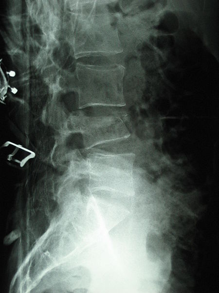
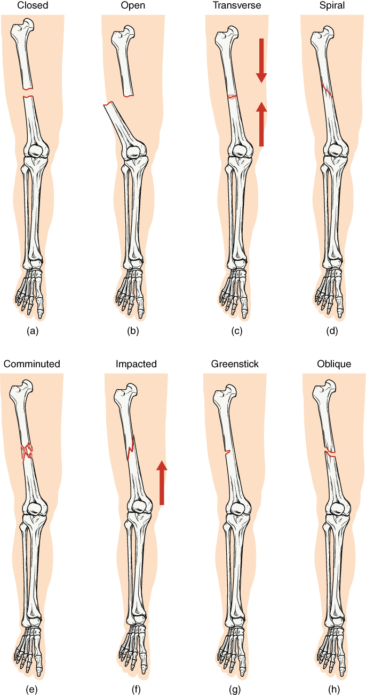

轻而易折的脊柱
=======

## 过程
1. 前期
    - 症状
        - 虚汗
        - 低烧
        - 腰背疼
        - 动作僵硬
        - 骨折
1. 骨折后
    - 症状
        - 背部压痛
        - 双下肢运动感觉消失
        - 大小便不能控制
        - X影像：T11压缩性骨折
        - 骨折椎体破坏性病变、骨质钙化

## 第一二幕
1. 儿童补充营养的方式
1. 虚汗、低烧的原因及疾病
1. 腰背疼、动作僵硬，动作慢的原因及疾病
1. T11骨折的症状、原因
1. 结核病的病理检查
1. 术前检查
    - CRP
    - ESR
    - 血结核抗体
    - PPD皮试(Targeted skin testing programs should be conducted only among high-risk groups)
        - 5 mm or more is positive in
            - An HIV-positive person
            - Persons with recent contacts with a TB patient
            - Persons with nodular or fibrotic changes on chest X-ray consistent with old healed TB
            - Patients with organ transplants, and other immunosuppressed patients
        - 10 mm or more is positive in
            - Recent arrivals (less than five years) from high-prevalence countries
            - Injection drug users
            - Residents and employees of high-risk congregate settings (e.g., prisons, nursing homes, hospitals, homeless shelters, etc.)
            - Mycobacteriology lab personnel
            - Persons with clinical conditions that place them at high risk (e.g., diabetes, prolonged corticosteroid therapy, leukemia, end-stage renal disease, chronic malabsorption syndromes, low body weight, etc.)
            - Children less than four years of age, or children and adolescents exposed to adults in high-risk categories
        - 15 mm or more is positive in
            - Persons with no known risk factors for TB
    - 血T-SPOT检查

      > T-SPOT.TB counts the number of antimycobacterial effector T cells, white blood cells that produce interferon-gamma,
      > in a sample of blood.
      >
      > **Advantages**
      > - comparatively fast (results within 24 hours),
      > - less influenced by previous BCG vaccination compared with the tuberculin skin test.
      >
      > the T-SPOT.TB uses relatively Mycobacterium tuberculosis-specific antigens (peptides called ESAT-6 and CFP-10).
      > ESAT-6 and CFP-10 are expressed by Mycobacterium tuberculosis,
      > but are absent from all currently used BCG vaccines and most nontuberculous mycobacteria.

1. 脊柱保护固定，翻身的注意事项
1. 椎体破坏的原因、破坏性病变、骨质钙化（肿瘤对脊柱的破坏）
1. 结核病
    - 原因
        - TB reactivation for Latent TB Infection patients
        - MTB Infection
    - 诊断
        - Chest X-Ray
        - Bacteriological evaluation with AFB(MTB's AFB Testing positive) or MTB[^NOTBPOLICY]
    - Clinical Features[^ClinicalFeatures]
        - Pain (Dom. Symptom)
        - Fever
        - Interferon-γ release assay
        - Tuberculin skin test+
        - High or moderate-elevated C-reactive Protein
        - Low in hemoglobin
        - Elevated Erythrocyte Sedimentation Rate
    - 传播方式
    - 症状
    - 治疗[^WHOTREATMENT]
        - Drug-susceptible TB
            - String Recommendation: the 6-month rifampicin-based regimen 2HRZE/4HR
            - Conditional Recommendtion: the fixed-dose combination tablets regimen
        - TB living with HIV
            - String Recommendation: TB treatment first, followed by ART within the first 8 weeks of treatment
                                     (HIV-positive patients with immunosupression within the first 2 weeks)
            - Conditional Recommendtion: extend the standard 6-month treatment to 8 months+
        - MDR-TB
    - 预防: BCG

[^NOTBPOLICY]: [WHO: End TB Strategy](./src/PBL_17-18_3/9789241511506-eng.pdf)
[^ClinicalFeatures]: [Characteristics and Clinical Outcome of Bone and Joint Tuberculosis, pp. 558](./src/PBL_17-18_3/civ326.pdf)
[^WHOTREATMENT]: [Guidelines for treatment of drug-susceptible tuberculosis and patient care](./src/PBL_17-18_3/who-treatment-eng.pdf)

## 第三幕
1. 窦道
1. 手术切口不愈合的原因
1. 手术切口
    - 分类
    - 愈合等级
1. 脓肿引流
1. 康复功能训练与营养神经治疗

## Other Information
### About Bone/Spinal TB (or Pott's disease)
#### Diagnosis
- Blood tests
    – CBC: leukocytosis(WBC↑)
    – Elevated erythrocyte sedimentation rate: >100 mm/h
- Tuberculin skin test
    – Tuberculin skin test (purified protein derivative [PPD]) results are positive in 84–95% of patients with Pott disease who are not infected with HIV.
- Radiographs of the spine
    – Radiographic changes associated with Pott disease present relatively late. The following are radiographic changes characteristic of spinal tuberculosis on plain radiography:
        - Lytic destruction of anterior portion of vertebral body
        - Increased anterior wedging
        - Collapse of vertebral body
        - Reactive sclerosis on a progressive lytic process
        - Enlarged psoas shadow with or without calcification
    – Additional radiographic findings may include the following:
        - Vertebral end plates are osteoporotic.
        - Intervertebral disks may be shrunk or destroyed.
        - Vertebral bodies show variable degrees of destruction.
        - Fusiform paravertebral shadows suggest abscess formation.
        - Bone lesions may occur at more than one level.
- Bone scan
- CT of the spine
- Bone biopsy
- MRI

#### Prognosis
- Sinus formation
- Vertebral collapse resulting in kyphosis
- [Spinal cord compression](#Compression)
- Paraplegia (so called Pott's paraplegia)

#### Management
- Non-operative – antituberculous drugs
- Analgesics
- Immobilization of the spine region using different types of braces and collars
- Surgery may be necessary, especially to drain spinal abscesses or debride bony lesions fully or to stabilize the spine. A 2007 review found just two randomized clinical trials with at least one year-follow up found which compared chemotherapy plus surgery with chemotherapy alone for treating people diagnosed with active tuberculosis of the spine. As such there is no high grade evidence but the results of this study indicates that surgery should not be recommended routinely and clinicians have to selectively judge and decide on which patients to operate.
- Thoracic spinal fusion with or without instrumentation as a last resort
- Physical therapy for pain-relieving modalities, postural education and teaching a home exercise program for strength and flexibility

### About Bone Fracture
#### Diagnosis
- X-ray
- CT
- MRI

#### Classification
[General Classifications (Figure 1)](#FractureClassification)

*(Classification by Anatomical Location)*

- Spinal Fracture
    - Cervical fracture
    - Clay-shoveler fracture
    - Burst fracture: in which a vertebra breaks from a high-energy axial load
    - [Compression fracture](#Compression)
    - Chance fracture: compression injury to the anterior portion of a vertebral body with concomitant distraction injury to posterior elements
    - Holdsworth fracture: an unstable fracture dislocation of the thoracolumbar junction of the spine

### Pictures
{#Compression}

{#FractureClassification}

