关节的致命之痛
==============
## 思维导图

```mermaid
graph LR
  subgraph 就诊经历
    exp1(当天上午)
    exp2(数天后)
    exp3(意外怀孕后)
  end

  exp1 -.- diag1
  exp1 -.- diag2
  exp2 -.- diag3
  exp2 -.- diag4
  exp2 -.- diag5
  exp3 -.- diag6

  subgraph 关键词
    diag1((类风湿关节炎))
    diag2((关节疼痛))
    diag3((系统性红斑狼疮))
    diag4((狼疮性肾炎))
    diag5((抗磷脂抗体综合征))
    diag6((系统性红斑狼疮与妊娠))
  end

  diag1_1(诊断)
  diag1_2(鉴别诊断)
  diag2_1(可能的病因)
  diag3_1(诊断)
  diag3_2(鉴别诊断)
  diag3_3(病因)
  diag3_4(治疗)
  diag3_5(预后)
  diag4_2(诊断)
  diag5_1(诊断)
  diag5_2(症状)
  diag5_3(治疗)
  diag6_1(什么时候可以妊娠)
  diag6_2(中止妊娠的方法)
  diag6_3("妊娠对 SLE 影响")
  diag6_4("SLE 对妊娠影响")

  diag1 --- diag1_1
  diag1 --- diag1_2
  diag2 --- diag2_1
  diag3 --- diag3_1
  diag3 --- diag3_2
  diag3 --- diag3_3
  diag3 --- diag3_4
  diag3 --- diag3_5
  diag4 --- diag4_2
  diag5 --- diag5_1
  diag5 --- diag5_2
  diag5 --- diag5_3
  diag6 --- diag6_1
  diag6 --- diag6_2
  diag6 --- diag6_3
  diag6 --- diag6_4

  diag1_1 --- 持续性关节炎
  diag1_1 --- 对称性小关节受累
  对称性小关节受累 --- 软组织肿胀
  对称性小关节受累 --- 骨融合
  diag1_1 --- 补体轻度升高与血小板降低
  diag1_1 --- 全身症状

  diag1_2 --- SLE

  diag2_1 --- 关节炎
  diag2_1 --- 滑膜炎
  diag2_1 --- 肌腱炎
  diag2_1 --- 骨/软骨炎
  关节炎 --- 外伤性关节炎
  关节炎 --- 化脓性关节炎
  关节炎 --- 结核性关节炎
  关节炎 --- 风湿性关节炎
  关节炎 --- 类风湿关节炎
  关节炎 --- 退行性关节炎

  diag3_1 --- 皮肤狼疮
  diag3_1 --- 光过敏
  diag3_1 --- 口腔溃疡
  diag3_1 --- 关节疼痛
  关节疼痛 --- 两个或以上关节疼痛
  diag3_1 --- 浆膜炎
  diag3_1 --- 肾炎
  diag3_1 --- 神经系统损伤
  diag3_1 --- 血象异常
  血象异常 --- wbc_low("WBC 小于 4")
  血象异常 --- plc_low("PLC 小于 100")
  diag3_1 --- 免疫学异常
  diag3_3 --- 雌激素相关
  diag3_3 --- 遗传因素
  diag3_3 --- 药物因素
  药物因素 --- 药物引起的自身反应
  diag3_3 --- 物理因素
  物理因素 --- 光过敏-紫外线照射
  diag3_3 --- 感染
  diag3_3 --- 内分泌因素
  diag3_4 --- 抗疟药物
  diag3_4 --- 抗炎药
  抗炎药 --- 非甾体类抗炎药
  抗炎药 --- 肾上腺皮质激素类抗炎药
  diag3_4 --- 免疫抑制药物
  diag3_5 === diag3_5_1("10 年存活率 >= 95%")
  diag3_5 --- 骨质疏松
  diag3_5 --- 慢性肾功能不全
  diag3_5 --- 免疫抑制

  diag4_2 --- 肾损害
  肾损害 --- 蛋白尿
  肾损害 --- bu("血尿（主要表现为尿隐血）")
  肾损害 --- 急性肾损害
  肾损害 --- 慢性肾衰
  肾损害 --- 肾小管间质损害
  肾损害 --- 抗磷脂抗体综合征
  diag4_2 --- 肾外损害

  diag5_1 --- ap("ACA 阳性")
  diag5_2 --- 主要为血栓形成
  diag5_3 --- 抗凝药物

  diag6_1 --- diag6_1_1("停用免疫抑制药物 >= 6 个月")
  diag6_1 --- diag6_1_2("妊娠前病情得到控制 >= 6 个月")
  diag6_1 --- diag6_1_3("无重要脏器损害")
  diag6_1 --- diag6_1_4("抗 ds-DNA 抗体阴性")
  diag6_1 --- diag6_1_5("无 APL 阳性 >= 1 个月")
  diag6_2 --- 妊娠前
  妊娠前 --- diag6_2_11("孕激素类避孕药：可以使用")
  妊娠前 --- diag6_2_12("雌激素类避孕药：加重病情，不可使用")
  diag6_2 --- 妊娠后
  妊娠后 --- diag6_2_21("人工流产")
  diag6_3 --- diag6_3_1("孕期加重：狼疮危象")
  diag6_3 --- diag6_3_2("产期加重")
  diag6_4 --- 母体
  母体 --- 狼疮肾炎发作
  母体 --- 产后出血倾向
  母体 --- 增加妊娠高血压综合征风险
  diag6_4 --- 胎儿
  胎儿 --- 流产
  胎儿 --- 早产
  胎儿 --- 死胎
  胎儿 --- 新生儿狼疮
```

## 过程
1. 就诊当天上午
    - 主诉：双手近端指间关节疼痛伴疲劳乏力 1 月余
    - 症状
        - 皮疹
        - 口腔溃疡
        - 脱发
    - 检查
        - X 线：未见明显异常
        - 类风湿因子：40 IU/L

1. 数天后
    - 检查
        - 血常规
            - WBC 3.0e9/L
            - PLC 80e9/L
        - 尿常规
            - 蛋白 ++
            - 隐血 ++
        - 免疫学检查
            - ANA +
            - 抗 dsDNA +
            - 抗 SSA +
            - 补体低下
            - 抗心磷脂抗体 +

## 第一幕
1. 类风湿关节炎
    - 病因
    - 症状
        - 持续性关节炎
        - 对称性小关节受累
            - 软组织肿胀
            - 骨融合
        - 血象异常
        - 全身症状
            - 晨僵
            - 午后乏力
            - 食欲减退
            - 全身虚弱
    - 诊断
    - 与 SLE 鉴别诊断
    - 流行病学特点
        - 女性患病率高
        - 致残率高

1. 类风湿因子
    - 定义: RA 相关性 **非特异性** 抗体
    - 检查方式: Lab test
    - Statistic identities[^RFStatistics]
        - Sensitivity: 69% (CI, 65% to 73%)
        - Specificity: 85% (CI, 82% to 88%)
    - 参考值范围: no more than 20 IU/mL

1. 关节疼痛可能的疾病
    - 外伤性关节炎
    - 化脓性关节炎
    - 结核性关节炎
    - 风湿性关节炎
    - 类风湿关节炎
    - 退行性关节炎

[^RFStatistics]: Luime, J. J.; Colin, E. M.; Hazes, J M W.; Lubberts, E. (2010). "Does anti-mutated citrullinated vimentin have additional value as a serological marker in the diagnostic and prognostic investigation of patients with rheumatoid arthritis? A systematic review". Annals of the Rheumatic Diseases. 69 (2): 337–344. doi:10.1136/ard.2008.103283. PMID 19289382.

## 第二幕
1. 免疫学检查内容
    - ANA
    - dsDNA
    - 抗 SSA
    - 补体
    - 抗心磷脂抗体

1. 系统性红斑狼疮
    - 诊断与症状
        - 1992 年标准（符合 4 项）
            - 蝶型红斑
            - 光过敏
            - 口腔溃疡
            - 关节疼痛
            - 浆膜炎
            - 肾炎
            - 神经系统损伤
            - 血象异常
                - WBC 小于 4
                - PLC 小于 100
        - 1997 年标准
        - 2009 年 SLICC 标准

1. 狼疮性肾炎
    - 症状
        - 肾损害
            - 蛋白尿
            - 血尿（主要表现为尿隐血）
            - 急性肾损害
            - 慢性肾衰
            - 肾小管间质损害
            - 抗磷脂抗体综合征
        - 肾外损害

1. 抗磷脂抗体综合征
    - 诊断: ACA 阳性
    - 症状: 主要为血栓形成

1. 医院诊断流程的优化

1. 隐血的病理机制与阳性意义
    - 隐血：尿中存在血红蛋白、肌红蛋白
    - 血尿：尿中含有一定量的 RBC

## 第三幕
1. 系统性红斑狼疮
    - 病因 (遗传因素、环境因素、雌激素, etc.)
        - 雌激素相关
        - 遗传因素
        - 药物因素：药物引起自身过敏反应
        - 物理因素：光过敏、紫外线照射
        - 感染
        - 内分泌因素
    - 治疗
        - 抗疟药
        - 非甾体类抗炎药
        - 肾上腺激素类抗炎药
        - 抗凝药物
        - 免疫抑制药物
    - 预后：10 年存活率 &gt; 95%

1. 系统性红斑狼疮与妊娠
    - 什么时候可以妊娠
        - 停用免疫抑制药物 &gt; 6 个月
        - 妊娠前病情得到控制 &gt; 6 个月
        - 无重要脏器损害
        - 抗 ds-DNA 抗体阴性
        - 无 APL 阳性 &gt; 1 个月
    - 妊娠后中止妊娠的方法
        - 妊娠前：孕激素类避孕药（雌激素类避孕药会加重病情，不可使用）
        - 妊娠后：人工流产
    - 妊娠对 SLE 的影响
        - 孕期加重：狼疮危象
        - 产期加重
    - SLE 对妊娠的影响
        - 母体
            - 狼疮肾炎发作
            - 产后出血倾向
            - 增加妊娠高血压综合征风险
        - 胎儿
            - 流产
            - 早产
            - 死胎
            - 新生儿狼疮
    - 妊娠期 SLE 药物治疗的不良反应
        - 糖皮质激素：可影响胎儿
        - 免疫抑制剂：可导致畸胎
