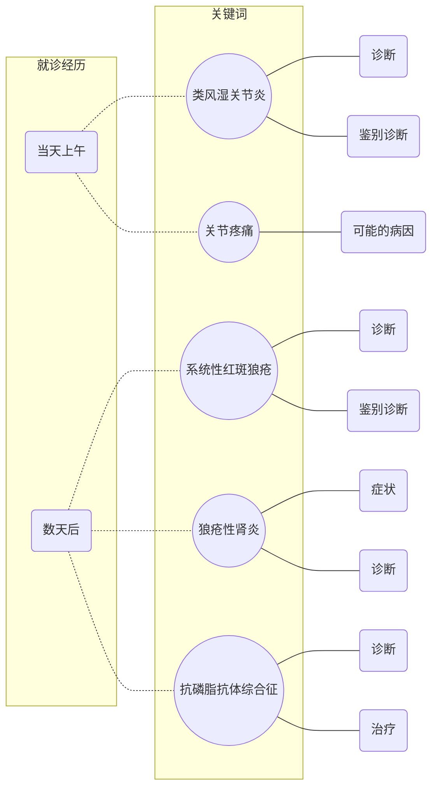

关节的致命之痛
==============
## 思维导图

## 过程
1. 就诊当天上午
    - 主诉：双手近端指间关节疼痛伴疲劳乏力 1 月余
    - 症状
        - 皮疹
        - 口腔溃疡
        - 脱发
    - 检查
        - X 线：未见明显异常
        - 类风湿因子：40 IU/L

1. 数天后
    - 检查
        - 血常规
            - WBC 3.0e9/L
            - PLC 80e9/L
        - 尿常规
            - 蛋白 ++
            - 隐血 ++
        - 免疫学检查
            - ANA +
            - 抗 dsDNA +
            - 抗 SSA +
            - 补体低下
            - 抗心磷脂抗体 +

## 第一幕
1. 类风湿关节炎
    - 病因
    - 症状
    - 诊断与鉴别诊断
    - 流行病学特点

1. 类风湿因子
    - 定义
    - 检查方式
    - 参考值范围

1. 关节疼痛可能的疾病

## 第二幕
1. 免疫学检查内容
    - ANA
    - dsDNA
    - 抗 SSA
    - 补体
    - 抗心磷脂抗体

1. 系统性红斑狼疮
    - 诊断
    - 症状

1. 狼疮性肾炎
    - 诊断
    - 症状

1. 抗磷脂抗体综合征
    - 诊断
    - 症状

1. 医院诊断流程的优化

1. 隐血的病理机制与阳性意义

## 第三幕

