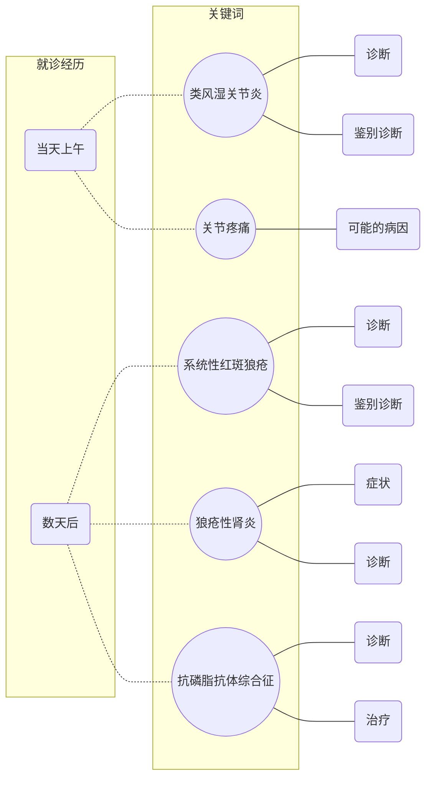

关节的致命之痛
==============
## 思维导图

## 过程
1. 就诊当天上午
    - 主诉：双手近端指间关节疼痛伴疲劳乏力 1 月余
    - 症状
        - 皮疹
        - 口腔溃疡
        - 脱发
    - 检查
        - X 线：未见明显异常
        - 类风湿因子：40 IU/L

1. 数天后
    - 检查
        - 血常规
            - WBC 3.0e9/L
            - PLC 80e9/L
        - 尿常规
            - 蛋白 ++
            - 隐血 ++
        - 免疫学检查
            - ANA +
            - 抗 dsDNA +
            - 抗 SSA +
            - 补体低下
            - 抗心磷脂抗体 +

## 第一幕
1. 类风湿关节炎
    - 症状
        - X-ray
            - Early stage: possibly no changes
            - Osteopenia
            - Soft tissue swelling
            - Bone erosions and subluxation
        - Rheumatoid Factor (Sensitivity ~ 75% to 85%)
        - other blood tests (e.g. anti-CCP antibody[^RFStatistics])
    - Differential Diagnosis
        - Crystal induced arthritis(gout)
        - Osteoarthritis
        - SLE
        - Psoriatic arthritis
        - Erosive arthritis induced by Lyme disease
        - Reactive arthritis
        - Axial spondylarthritis
        - Hepatitis C
        - Gonococcal arthritis (bacterial infection)

1. 类风湿因子
    - 定义: Non-specific antibody related to RA
    - Statistic identities[^RFStatistics]
        - Sensitivity: 69% (CI, 65% to 73%)
        - Specificity: 85% (CI, 82% to 88%)
        - Positive NLL ratio: 4.86 (CI, 3.95 to 5.97)
        - Negative NLL ratio: 0.38 (CI, 0.33 to 0.44)
    - Significance: indicating the occurance of suspected autoimmune activity
                    (related or not related to RA)
    - 参考值范围
        - no more than 20 IU/mL
        - no more than 1:40
        - no more than 95%

1. Arthralgia[^ArthralgiaCls]
    - Monoarticular arthralgia
        - tendonitis
        - fasciitis
        - bursitis
        - injury
    - Polyarticular arthralgia
        - Fibomyalgia
        - Osteoarthritis
        - Rheumatoid arthritis
        - Systemic lupus erythematosus
        - Reactive arthritis
        - Psoriatic arthritis
        - Enteropathic arthropathy
        - Gout
        - Polymyalgia rheumatica
    - Musculoskeletal emergencies
        - Septic arthritis
        - Joint fractures
        - Osteomyelitis
        - Joint dislocation
    - Back pain
        - Repetitive strain injury
        - Vertebral fractures
        - Whiplash injury
        - Sciatica
    - Non-specific arthralgia
        - Chronic depression
        - Fatigue

[^RFStatistics]: Luime, J. J.; Colin, E. M.; Hazes, J M W.; Lubberts, E. (2010). "Does anti-mutated citrullinated vimentin have additional value as a serological marker in the diagnostic and prognostic investigation of patients with rheumatoid arthritis? A systematic review". Annals of the Rheumatic Diseases. 69 (2): 337–344. doi:10.1136/ard.2008.103283. PMID 19289382.
[^ArthralgiaCls]: https://www.findatopdoc.com/Medical-Library/Diseases-and-Conditions/Arthralgia

## 第二幕
1. Immunological testing
    - Anti-nuclear antibodies (ANA): Diagnosis for SLE
    - Anti-dsDNA (More specificity[^AboutSLE], while limited diagnostic value[^AntidsDNARsrch])
    - Anti-SSA
    - Complement level: Low C3 and C4 is usually seen in SLE, not specific.
                        Can be used to measure the activity of SLE.
    - Antiphospholipid antibodies (aPL): Positive in about 50% of SLE patients.
                                         Cautious of coagulation.

1. 系统性红斑狼疮[^ANADiag]
    - 诊断: Positive ANA titer with associated clinical signs
            (e.g. skin abnomality, polyarthritis)
            and laboratory findings
            (e.g. proteinuria, thrombocytopenia)
    - 症状

1. Lupus nephritis
    - Classification
        - Class I:   minimal mesangial glomerulonephritis
        - Class II:  mesangial proliferative glomerulonephritis
        - Class III: focal proliferative glomerulonephritis
        - Class IV:  diffuse proliferative glomerulonephritis
        - Class V:   membranous glomerulonephritis

1. 抗磷脂抗体综合征
    - Diagnosis: High in aPL without clotting abnomality.
    - Treatment: anticoagulation (to prevent blood clotting)

1. 医院诊断流程的优化

1. 隐血的病理机制与阳性意义

[^ANADiag]: https://ahdc.vet.cornell.edu/Sects/ClinPath/test/immun/ana.cfm
[^AntidsDNARsrch]: https://www.ncbi.nlm.nih.gov/pmc/articles/PMC4648223/
[^AboutSLE]: https://www.hss.edu/conditions_understanding-laboratory-tests-and-results-for-systemic-lupus-erythematosus.asp

## 第三幕

