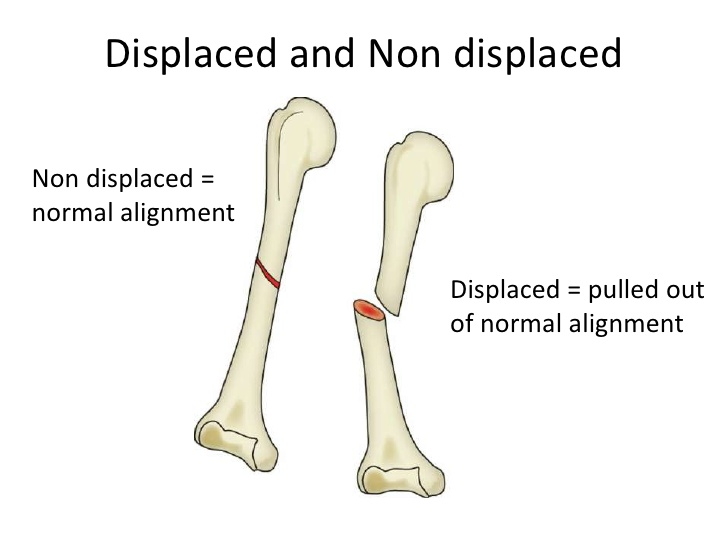

# 徐老自作孽
## 思维导图

## 过程
1. 半年前
    - 症状：左腿肿胀
    - 高位因素
        - 高龄：70 岁
        - 缺乏运动
        - 烟酒
        - 长时间静坐

1. 当日
    - 症状
        - 腿软
        - 左大腿根部剧烈疼痛
    - 检查
        - 体格检查
            - 腿一侧变短并向外倒
            - 左大腿根部畸形肿胀，伴压痛
            - 左小腿足踝有压凹性肿胀，无压痛
        - X 片
            - 股骨转子粉碎性骨折

1. 三天后
    - 检查
        - 体格检查
            - 左小腿足踝肿胀明显
            - 左大腿近端出现淤血肿胀
            - 左髋关节不能活动
        - 血常规
            - Hb: 72 g/L
            - WBC: 10.25e9
            - N: 82%
        - 血生化
            - 总蛋白: 56.3 g/L
            - 白蛋白: 26.6 g/L
        - 双下肢血管彩超
            - 左侧腓肠肌静脉丛血栓形成
            - 腘静脉血栓形成

## 第一幕
1. 止痛针

1. 下肢深静脉血栓
    - 危险因素
    - 症状
    - 预防（抗凝治疗, etc.）
    - 治疗
    - 预后

1. 下肢凹陷性水肿
    - 病因

1. 绿色通道的开放条件

## 第二幕
1. 骨折
    - 髋关节骨折
        - 症状
        - 治疗
    - 股骨转子骨折
        - 病因
        - 症状
        - 并发症
    - 粉碎性骨折
        - 定义
        - 诱因
        - 治疗
    - 各种骨折的类型

      

1. 闭合复位髓内钉内固定手术
    - 适应症
    - 禁忌症

1. 各项检查
    - 血常规
    - 血生化
    - 血管彩超

1. 腓肠肌静脉丛和腘静脉丛类型

1. 家属未到场时医生应如何与病人沟通治疗方案

1. 家属与病人观点不一致时医生应如何处理

## 第三幕

