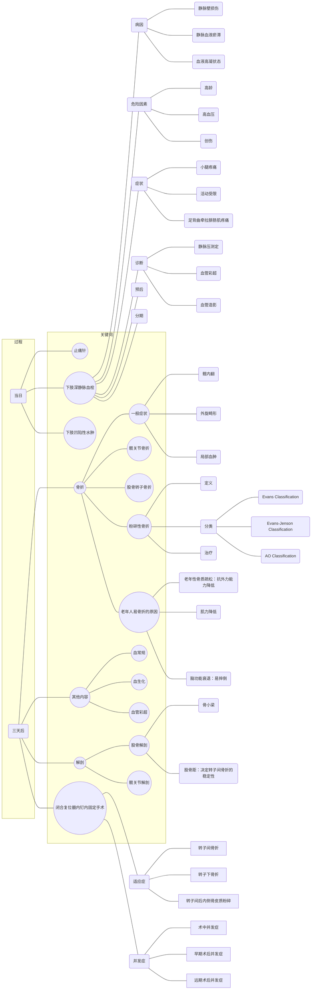

# 徐老自作孽
## 思维导图

## 过程
1. 半年前
    - 症状：左腿肿胀
    - 高危因素
        - 高龄：70 岁
        - 缺乏运动
        - 烟酒
        - 长时间静坐

1. 当日
    - 症状
        - 腿软
        - 左大腿根部剧烈疼痛
    - 检查
        - 体格检查
            - 腿一侧变短并向外倒
            - 左大腿根部畸形肿胀，伴压痛
            - 左小腿足踝有压凹性肿胀，无压痛
        - X 片
            - 股骨转子粉碎性骨折

1. 三天后
    - 检查
        - 体格检查
            - 左小腿足踝肿胀明显
            - 左大腿近端出现淤血肿胀
            - 左髋关节不能活动
        - 血常规
            - Hb: 72 g/L
            - WBC: 10.25e9
            - N: 82%
        - 血生化
            - 总蛋白: 56.3 g/L
            - 白蛋白: 26.6 g/L
        - 双下肢血管彩超
            - 左侧腓肠肌静脉丛血栓形成
            - 腘静脉血栓形成
    - 治疗：闭合复位髓内钉内固定手术

1. 术后 3 天
    - 症状
        - 昏迷
    - 检查
        - 血常规
            - Hb 66 g/L
            - WBC 13.35e9
            - N 87%
        - 血生化
            - 总蛋白: 49.3 g/L
            - 白蛋白: 21.6 g/L
        - 双下肢血管彩超
            - 左腘静脉血栓未加重
        - 查体
            - 左髋部大腿根部肿胀淤青
    - 治疗
        - 输血
        - 白蛋白补充
        - 鼻饲营养
        - 口服钙剂、维生素 D

## 第一幕
1. 止痛针

1. 下肢深静脉血栓
    - 病因
        - 静脉壁损伤
        - 静脉血液瘀滞
        - 血液高凝状态
    - 危险因素
        - 高龄
        - 高血压
        - 创伤
    - 症状
        - 小腿疼痛
        - 活动受限
        - 足背曲牵拉腓肠肌疼痛
    - 预防（抗凝治疗, etc.）
    - 诊断
        - 静脉压测定
        - 血管彩超
        - 血管造影
    - 治疗：抗凝治疗
    - 预后
    - 血栓分型
        - 周围型
        - 中央型
        - 混合型
    - 分期
    - 溶栓治疗如何减少出血风险

1. 下肢凹陷性水肿
    - 病因

1. 绿色通道的开放条件

## 第二幕
1. 骨折
    - 原因
        - 老年性骨质疏松：抗外力能力降低
        - 肌力降低
        - 脑功能衰退：易摔倒
    - 一般症状
        - 全身
        - 一般表现
            - 局部疼痛
            - 运动功能障碍
    - 髋关节骨折
        - 症状
            - 髋内翻
            - 外旋畸形（多大于90度）
            - 局部血肿
        - 治疗
    - 股骨转子粉碎性骨折
        - 定义：骨碎裂成 3 块及以上
        - 分类
            - Evans Classification
            - Evans-Jenson Classification
            - AO Classification
        - 治疗
            - 保守治疗
            - 手术治疗
                - 髓内固定：适合于顺转子骨折
                - 髓外（钉板）固定
    - 各种骨折的类型
    - 愈合标准
    - 康复评价

1. 解剖
    - 股骨解剖
        - 骨小梁
        - 股骨距：决定转子间骨折的稳定性
    - 髋关节解剖

1. 闭合复位髓内钉内固定手术
    - 适应症
        - 转子间骨折
        - 转子下骨折
        - 转子间后内侧骨皮质粉碎
    - 并发症
        - 术中并发症
            - 股骨外并发症
            - 股骨破坏
            - 髋内翻畸形
            - 骨不连
            - 股骨头坏死
            - 血管神经损伤
        - 早期术后并发症
            - 脂肪栓塞
        - 远期术后并发症

1. 各项检查
    - 血常规
    - 血生化
    - 血管彩超

1. 腓肠肌静脉丛和腘静脉类型
    - 腓肠肌静脉丛
    - 腘静脉

1. 家属未到场时医生应如何与病人沟通治疗方案

1. 家属与病人观点不一致时医生应如何处理

## 第三幕
1. 外科营养
