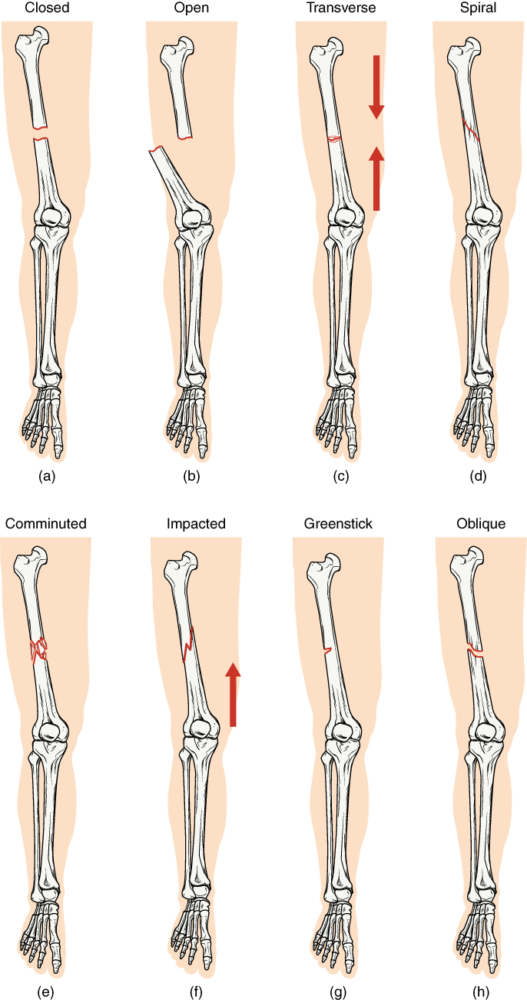

# 徐老自作孽
## 第一幕
1. 止痛针

1. 下肢深静脉血栓
    - Risk Factors[^VTERF] (ordered by RR in each category, with the greater RR inteval gte 8)
        - Generic
            - Antithrombin deficiency
            - Protein C deficiency
            - Protein S type I deficiency
        - Acquired
            - **Increasing age**
            - Malignancy
            - Lupus anticoagulant
            - Systemic Lupus Erythematosus
            - HIV
            - Nephrotic syndrome
            - Renal transplant recipients
            - Previous archived VTE
        - Environmental
            - Surgery, trauma, **immobilization**
        - Mixed
            - Low free protein S levels
        - Not well established (only related risk factors are listed)
            - **Air pollution (1.1 - 2.0)**
            - **Hypertension (0.7 - 2.0)**
            - **Male sex (0.8 - 1.5)**
            - **Smoking (0.8 - 1.5)**
    - Diagnosis[^VTEDT]
        - DVT probability determining procedure (scores +3)
            - +1 - Active cancer (treatment within last 6 months or palliative)
            - +1 - Calf swelling ≥ 3 cm compared to asymptomatic calf (measured 10 cm below tibial tuberosity)
            - +1 - Swollen unilateral superficial veins (non-varicose, in symptomatic leg)
            - +1 - Unilateral pitting edema (in symptomatic leg)
            - +1 - Previous documented DVT
            - +1 - Swelling of entire leg
            - +1 - Localized tenderness along the deep venous system
            - +1 - Paralysis, paresis, or recent cast immobilization of lower extremities
            - +1 - Recently bedridden ≥ 3 days, or major surgery requiring regional or general anesthetic in the past 12 weeks
            - -2 - Alternative diagnosis at least as likely
        - D-dimer test
        - Ultrasound test
        - Proposed Diagnostic algorithm

          

    - Treatment[^VTEDT]
        - Short-term: To prevent extension of thrombus and pulmonary embolism
            - unfractioned heparin for at least 5 d
            - LMW heparin for at least 5 d
        - Long-term: To prevent recurrent events
            - vitamin K antagonists o.p. for at least 3 m

1. 下肢凹陷性水肿
    - 病因

1. 绿色通道的开放条件

[^VTERF]: Lijfering WM, Rosendaal FR, Cannegieter SC (2010). "Risk factors for venous thrombosis – current understanding from an epidemiological point of view". Br J Haematol. 149 (6): 824–33. doi:10.1111/j.1365-2141.2010.08206.x. PMID 20456358.
[^VTEDT]: Scarvelis D, Wells P (2006). "Diagnosis and treatment of deep-vein thrombosis". CMAJ. 175 (9): 1087–92. doi:10.1503/cmaj.060366. PMC 1609160. PMID 17060659.

## 第二幕
1. 骨折
    - Pelvic fracture
        - Symptom: pain
        - Treatment
            - Stablization: pelvic binder
            - Surgery: external/internal fixation and traction
            - Rehabiliation
    - Trochanteric fracture[^TTF]
        - 病因
        - 症状
        - 并发症
        - Diagnosis: mainly X-ray
        - Treatment
            - Functional treatment: relatively high motality rate
            - Conservative treatment: only used for patients with anesthesiological contra-indication
            - Surgical treatment: open reduction internal fixation (ORIF).
              Notes: Intra-medullary nailing seems to give better results than screw-plates only in subtrochanteric fracture[^IMNVSSPF].
                - intra medullary nailing
                - screw-plate fixation
        - Prognosis (for elderly subjects): 6-month mortality exceeding 25%
        - Classification
            - Evans-Jenson classification

              | Type | Description                                               |
              |------|-----------------------------------------------------------|
              | I  A | 2-part non-displaced                                      |
              | I  B | 2-part displaced                                          |
              | II A | 3-part fracture with separate greater trochanter fragment |
              | II B | 3-part fracture with separate lesser trochanter fragment  |
              | III  | 4-part fracture                                           |
            - AO classification

              | Type | Description                                         |
              |------|-----------------------------------------------------|
              | 31A1 | simple 2-fragment pertrochanteric                   |
              | 31A2 | multi-fragment pertrochanteric                      |
              | 31A3 | intertrochanteric, each subdivided into 3 subgroups |

    - 粉碎性骨折
        - 定义
        - 诱因
        - 治疗
    - 各种骨折的类型

      

1. 闭合复位髓内钉内固定手术
    - 适应症
    - 禁忌症

    

1. 各项检查
    - 血常规
    - 血生化
    - 血管彩超

1. 腓肠肌静脉丛和腘静脉类型
    - 腓肠肌静脉丛：深静脉
    - 腘静脉：深静脉

1. 家属未到场时医生应如何与病人沟通治疗方案

1. 家属与病人观点不一致时医生应如何处理

[^TTF]: P. Adam. "Treatment of recent trochanteric fracture in adults". Orthopaedics & Traumatology: Surgery & Research 100(1) S75-S83. doi:10.1016/j.otsr.2013.11.007
[^IMNVSSPF]: M. Parker, H. Handoll. Gamma and other cephalocondylic intra-medullary nails versus extramedullary implants for extracapsular hip fractures in adults. Cochrane Database Syst Rev (2010). doi:10.1016/j.otsr.2013.11.007.
## 第三幕

