谁“偷”了我的肾
====
## 思维导图

```mermaid
graph LR
  subgraph 疾病发展过程
    p1("一月前")
    p2("住院三天后")
    p3("出院一月后")
  end

  p1 --- k1
  p1 --- k2
  p1 --- k3
  p1 --- k4
  p1 --- k5
  p2 --- k6
  p2 --- k7
  p2 --- ka
  p3 --- k8
  p3 --- k9

  subgraph 关键词
    k1(("骨盆骨折"))
    k2(("肋骨骨折"))
    k3(("腓骨骨折"))
    k4(("休克"))
    k5(("外伤急救转运"))
    k6(("脾破裂"))
    k7(("放射痛"))
    k8(("外伤后肾脏移位变性萎缩"))
    k9(("肾解剖结构"))
    ka(("<del>膈肌破裂</del>"))
  end

  k1 --- k10("解剖")
  k1 --- k11("分型")
    k11 --- k111("Tile 分型")
    k11 --- k112("AO-OTA 分型")
  k1 --- k12("诊断")
    k12 --- k121("CT")
    k12 --- k122("B 超")
  k1 --- k13("<b>并发症</b>")
    k13 --- k131("失血性休克")
    k13 --- k132("盆腔内脏器损伤")
    k13 --- k133("神经损伤")
    k13 --- k134("脂肪栓塞、静脉栓塞")
  k1 --- k14("治疗")
    k14 --- k141("保守治疗")
    k14 --- k142("手术治疗")
    k142 --- k1421("前方固定")
    k142 --- k1422("后方固定")

  k2 --- k21("分型")
  k2 --- k22("诊断")
  k2 --- k23("症状")
    k23 --- k231("局部疼痛（放射性疼痛）")
    k23 --- k232("局部肿胀")
    k23 --- k233("局部异响")
    k23 --- k234("呼吸困难（反常性呼吸）")

  k4 --- k41("分型")
    k41 --- k411("低血容量性休克（出血性休克）")
    k41 --- k412("心源性休克")
    k41 --- k413("脓毒性休克")
    k41 --- k414("过敏性休克")
    k41 --- k415("神经源性休克")
  k4 --- k42("分期与机体代偿")
    k42 --- k421("缺血性缺氧期")
    k42 --- k422("淤血性缺氧期")
    k42 --- k423("微循环衰竭期")
  k4 --- k43("临床表现")
  k4 --- k44("诊断")
  k4 --- k45("治疗")
    k45 --- k431("补充血容量")
    k45 --- k432("止血")
    k45 --- k433("纠正酸碱平衡")
    k45 --- k434("血管活性药物")
  k4 --- k46("对肾脏的影响")
    k46 --- k461("早期：急性功能性肾衰竭（GFR↓）")
    k46 --- k462("晚期：急性器质性肾衰竭（急性肾小管坏死）")

  k5 --- k51("院外抢救")
    k51 --- k511("TI 评分")
  k5 --- k52("院内抢救（分拣）")
    k52 --- k521("保持正常通气、给氧")
    k52 --- k522("输液输血，保持血容量")
    k52 --- k523("控制失血")

  k6 --- k61("解剖")
  k6 --- k62("病因")
    k62 --- k621("创伤性脾破裂")
      k621 --- k6211("开放性脾损伤")
      k621 --- k6212("闭合性脾损伤")
    k62 --- k622("自发性脾破裂")
    k62 --- k623("医源性脾破裂")
    k62 --- k624("延迟性脾破裂：脾外伤 48 h 后表现脾破裂症状")
      k624 --- k6241("包膜下出血破裂")
      k624 --- k6242("脾破裂后血凝块、与周围脏器形成血肿，再次外伤出血")
      k624 --- k6243("破裂伤较小，出血缓慢")
  k6 --- k63("分型")
    k63 --- k631("脾实质及包膜破裂（最常见）")
    k63 --- k632("脾实质中央分裂")
    k63 --- k633("包膜下破裂")
    k63 --- k634("脾蒂撕裂伤")
  k6 --- k64("症状")
    k64 --- k641("失血（失血性休克、低血压）")
    k64 --- k642("腹痛、腹膜刺激征（板状腹）")
    k64 --- k643("腹腔积液（移动性浊音）")
  k6 --- k65("诊断")
    k65 --- k651("外伤史")
    k65 --- k652("体征")
    k65 --- k653("影像学检查（X 线、超声）")
    k65 --- k654("腹穿")
  k6 --- k66("鉴别诊断")
    k66 --- k661("自发性脾破裂：一般有基础性病变")
  k6 --- k67("治疗")
    k67 --- k671("保守治疗（预防延迟性脾破裂）")
      k671 --- k6711("生命体征平稳")
      k671 --- k6712("腹膜刺激征经治疗后好转")
      k671 --- k6713("血色素、RBC 波动范围不大")
      k671 --- k6714("腹腔穿刺抽出血液不多")
      k671 --- k6715("左上腹顿挫伤")
    k67 --- k672("紧急性全脾切除术")
    k67 --- k673("脾脏修补术")
    k67 --- k674("脾部分切除")
    k67 --- k675("脾动脉结扎")
    k67 --- k676("纤维蛋白黏合术")
    k67 --- k677("局部止血术")
  k6 --- k68("复诊")
    k68 --- k681("B 超")
    k68 --- k682("CT")
    k68 --- k683("核素扫描")
    k68 --- k684("选择性腹腔动脉造影")

  k7 --- k71("Heart disease")
  k7 --- k72("Lung and Diaphragm")
  k7 --- k73("Liver and Gallbladder")
  k7 --- k74("Stomach and Pancreas")
  k7 --- k75("Small intestine")
  k7 --- k76("Colon and appendix")
  k7 --- k77("Kidney")
  k7 --- k78("Bladder")
  k7 --- k79("Ovary")

  k8 --- k81("原因")
    k81 --- k811("TRAT")
    k81 --- k812("先天发育不全")
    k81 --- k813("梗阻性肾萎缩")
    k81 --- k814("肾实质病变")
    k81 --- k815("缺血性肾萎缩")
  k8 --- k82("肾损伤分级")
    k82 --- k821("肾挫伤")
    k82 --- k822("肾挫裂伤")
    k82 --- k823("肾全层裂伤")
    k82 --- k824("肾蒂损伤")
    k82 --- k825("肾破裂")

  ka --- ka1("<del>膈肌解剖结构</del>")
```

## 过程
1. 一月前
    - 症状
        - 生命体征
            - BP: 80/50 mmHg
            - HR: 100
        - 外伤
            - 头部、右下肢皮肤破损
            - 右胸部及右髂骨明显压痛、叩痛
        - 影像学检查
            - 骨盆骨折
            - 右侧第 8, 9 肋骨折
            - 右侧腓骨上段骨折
            - 头部及胸腹部脏器未见明显损伤
    - 治疗
        - 抗休克：补液、输血
        - 胸带肋骨固定
        - 右下肢清创、石膏固定
    - 诊断
        - 失血性休克
        - 右髂骨翼骨折
        - 右第 8, 9 肋骨折
        - 右腓骨骨折

1. 住院三天后
    - 症状
        - 生命体征
            - 脉搏细速
            - 呼吸急促
            - 血压不稳
        - 主诉
            - 左下腹疼痛
            - 左上腹疼痛
            - 左肩放射痛
        - 体格检查
            - 左上腹局部压痛
            - 左上腹包块
        - B 超检查
            - 腹腔内液性暗区，并可随体位变化移动
            - 脾脏回声不均匀，内部可见低回声区
        - 腹穿：血性液体
        - CT 检查：脾破裂
    - 治疗
        - 抗休克：补液、输血
        - 脾脏修补术

1. 出院一月后
    - 症状
        - 暴食后腹痛
        - 影像学检查
            - 腹部 CT : 右侧肾脏缺失
            - MRI：肝脏内后方与右侧膈脚间软组织影
    - 诊断：外伤后右侧肾脏移位、变形、萎缩

## 第一幕
1. 骨折
    - 解剖
        - 薄弱部位：髂骨翼、骶髂关节、骶骨关节
    - 骨盆骨折
        - 分型
            - Tile 分型
            - AO-OTA 分型
            - Young-Bergess 分型
        - 诊断
            - 病史
            - 体格检查
            - 影像学检查
                - 平片
                - CT
                - MRI
                - 血管造影 (DSA)
        - 症状
            - 失血性休克
            - 血肿
            - 骨盆变化
            - 疼痛
            - 血尿
            - 盆腔积液/积血/感染
            - 发热
            - 神经血管损害
        - **并发症**
            - 早期
                - 出血
                - 感染
                - 胃肠症状
                - 泌尿生殖器损伤
                - 固定失败/复位丢失
            - 晚期
                - 血栓栓塞
                - 畸形愈合
                - 骨不连
                - 慢性疼痛
                - 神经损伤
        - 治疗
            - 保守治疗
            - 手术治疗
                - 前方固定
                - 后方固定
    - 肋骨骨折
        - 分型
        - 诊断
        - 症状
            - 局部疼痛（放射性疼痛）
            - 局部肿胀
            - 局部异响
            - 呼吸困难（反常性呼吸）
    - 腓骨骨折
        - 诊断

1. 休克
    - 分型
        - 低血容量性休克（出血性休克）
        - 心源性休克
        - 脓毒性休克
        - 过敏性休克
        - 神经源性休克
    - 分期与机体代偿
        - 缺血性缺氧期
        - 淤血性缺氧期
        - 微循环衰竭期
    - 临床表现
    - 创伤性失血性休克的诊断（符合下列条件1，以及2、3、4项中2项，或5、6、7项中1项）
        1. 有导致大出血的创伤，如道路交通伤等；
        2. 意识改变，如烦燥不安或神志淡漠、昏迷等；
        3. 脉搏细速，＞100次／min或不能触及，休克指数＞1.0；
        4. 皮肤湿冷，胸骨部位皮肤指压痕阳性指压后再充盈时间＞2s. ，皮肤可见花斑、黏膜苍白或发绀，尿量＜30mL／h或无尿；
        5. 收缩压＜80mmHg；
        6. 脉压差＜20mmHg；
        7. 原有高血压者收缩压较原收缩压下降30％以上。
    - 创伤性失血性休克的早期救治
        - 现场：应采取有效的止血措施，积极控制四肢、交界部位和躯干体表的活动性出血，处理原发创伤；
                现场急救时，应争取建立静脉及骨内输液通道，快速补充晶体液，防止休克的发生
        - 途中及急诊科：密切观察病情变化，积极建立静脉或骨内输液通道，对出血已控制的休克患者可采用常规复苏；
                        对有活动性出血的非控制性出血休克患者推荐采用允许性低压复苏，并尽可能早期给予器官功能保护措施
        - 急诊室：快速检查迅速判定，是否还存在活动性出血和休克程度，尽快送手术室手术
        - 手术室：手术过程中，活动性出血尚未完全控制前，建议液体复苏仍然采用允许性低压复苏，彻底止血后可采用常规复苏
        - 重症医学科：术后24h内应积极恢复患者内环境稳定，恢复患者酸碱平衡及电解质平衡，积极预防和处理致死三联征的发生
    - 治疗
        - 补充血容量
        - 止血
        - 纠正酸碱平衡
        - 血管活性药物
    - 休克后器官损伤的原因
        - 由能量代谢障碍
        - 过度炎症反应
        - 氧自由基损伤
        - 血管低反应性
        - 凝血功能紊乱等造成
    - 对肾脏的影响
        - 早期：急性功能性肾衰竭（GFR↓）
        - 晚期：急性器质性肾衰竭（急性肾小管坏死）

1. 外伤患者急救转运
    - 流程
    - 院前救护
        - 分检: 由最先到达现场的院前急救人员对伤员进行分检急救, 边抢救危重患者边了解现场情况, 同时报告院急诊科,
                嘱启动突发事件应急预案, 报告内容包括时间、地点、伤情、人数等。
        - 现场急救: 迅速将伤员脱离危险地带,通过视、触、听的方法快速预检患者,
                    即观察伤员的受伤程度、意识、瞳孔、呼吸、皮肤颜色、表情等;
                    触肢体的温湿度、大动脉搏动情况;听有无声音及声音有无嘶哑, 依伤情轻重缓急开展现场抢救。
                    保持呼吸道通畅, 吸氧, 建立静脉通路, 伤口包扎止血, 骨折用夹板固定, 疑有颈椎骨折或脱位时先用颈托固定。
        - 转运: 经紧急处置后的危重患者由救护车运送回院, 途中持续心电监护, 动态观察病情变化。
    - 院内抢救
        - 通知有关部门、科室做好准备
        - 分检组: 根据院前护士的交班对患者进行病情分级，在分检及伤情评估过程中, 要特别注意患者的意识,
                  对于表情淡漠、沉默不语及反应迟钝者, 应警惕存在内脏损伤。
        - 抢救治疗组: 每位危重患者的抢救均由两名护士负责, 分工协助, 与医生默契配合。
                      危重患者按 VIPC抢救程序进行急救护理。
                      车祸伤患者大部分为复合伤、多发伤, 尤其要注意闭合性的损伤出血。
                      （闭合性损伤是当人体受钝力打击或挫压等，受伤部位的皮肤仍保持其完整性的损伤，
                      常可伴有脑或胸腹腔器官的损伤。有时在受伤部位虽然可发现损伤，但并不伴有皮肤破裂或外出血）
        - 转运联络组: 患者经紧急救治后, 对急需检查及住院的患者, 由该组人员先与相关科室联系,
                      通知做好检查、住院准备, 按先急后轻的顺序合理分流患者, 所有患者均走绿色通道, 先抢救后补办住院手续。
        - 维持秩序组: 由总值或保安队长指挥, 对现场人员及家属进行合理的安抚和分流, 避免人员混乱影响伤者的抢救, 同时保障伤者及科室财物的安全。
    - 分拣
        - 第一类(红色) 伤势严重，威胁生命，需紧急救治
        - 第二类(黄色) 伤势较重，暂无生命危险
        - 第三类(绿色) 伤势较轻，独自处理，自行转院
        - 第四类(黑色) 已死亡或无法救治
    - 评分方法
        - 院前评分
            - 创伤指数 TI
            - 院前指数 PHI
            - 创伤积分 TS
            - 修正创伤积分 RTS
            - CRAMS 评分
        - 院内评分
            - 简明损伤定级 AIS
            - 损伤严重度评分 ISS
            - 解剖要点评分 AP
            - 生存概率 Ps
            - 急性生理与既往健康状况评估 APACHE

## 第二幕
1. 脾破裂
    - 解剖学知识
        - 位置（图）
        - 韧带
            - 胃脾韧带
            - 脾肾韧带
        - 功能
            - 储血
            - 破血
            - 造血
            - 滤血
            - 免疫
        - 血供
            - 脾动脉
            - 胃短动脉
            - 胃网膜左动脉
            - 胃后动脉
    - 分类
        - 按病因：
            - 创伤性脾破裂
                - 开放性脾损伤
                - 闭合性脾损伤
            - 自发性脾破裂：一般有基础性病变
            - 医源性脾破裂
            - 延迟性脾破裂：脾外伤 48 h 后表现脾破裂症状
                - 包膜下出血破裂
                - 脾破裂后血凝块、与周围脏器形成血肿，再次外伤出血
                - 破裂伤较小，出血缓慢
        - 按时间：
            - 急性脾破裂
            - 延迟性脾破裂
        - 按病理类型
            - 脾实质中央破裂
            - 脾实质及包膜破裂
            - 脾蒂撕裂伤
            - 包膜下破裂
    - 临床表现
        - 症状：腹痛、出血、休克等
        - 体征：压痛、反跳痛、腹肌强直、Kenr征等
        - 合并伤：肝胰肠损伤、骨折等
    - 症状
        - 失血（失血性休克、低血压）
        - 腹痛、腹膜刺激征（板状腹）
        - 腹腔积液（移动性浊音）
    - 诊断
        - 外伤史
        - 体征
        - 血液检查
        - 胰淀粉酶测定
        - 尿常规测检查
        - X线检查
        - 腹腔穿刺
        - 腹腔灌洗
        - 腹腔镜检查
        - 超声波检查
        - 放射性同位素扫描
        - 电子计算机体层扫描（CT）
    - 治疗
        - 保守治疗（预防延迟性脾破裂）
            - 生命体征平稳
            - 腹膜刺激征经治疗后好转
            - 血色素、RBC 波动范围不大
            - 腹腔穿刺抽出血液不多
            - 左上腹顿挫伤
        - 保留脾脏的治疗
        - 局部止血术
        - 紧急性全脾切除术
        - 纤维蛋白粘合术
        - 脾动脉结扎
        - 脾包膜缝合
        - 脾包裹术
        - 脾脏修补术
        - 脾部分切除

1. 各种放射痛

## 第三幕
1. 脾脏修补术复诊内容
    - B 超
    - CT
    - 核素扫描
    - 选择性腹腔动脉造影

1. 外伤后肾脏移位、变形、萎缩
    - 原因
        - TRAT
        - 先天发育不全
        - 梗阻性肾萎缩
        - 肾实质病变
        - 缺血性肾萎缩
    - 分型
        - 肾挫伤
        - 肾挫裂伤
        - 肾全层裂伤
        - 肾蒂损伤
        - 肾破裂

1. 创伤患者诊疗思路

1. 膈肌破裂
    - 膈肌解剖结构
    - 肾脏解剖结构
        - 肾血流
        - 肾损伤后病理生理变化

1. 腹部损伤
    - 并发症

1. 医患沟通
    - 如何与罕见病、罕见并发症患者沟通
